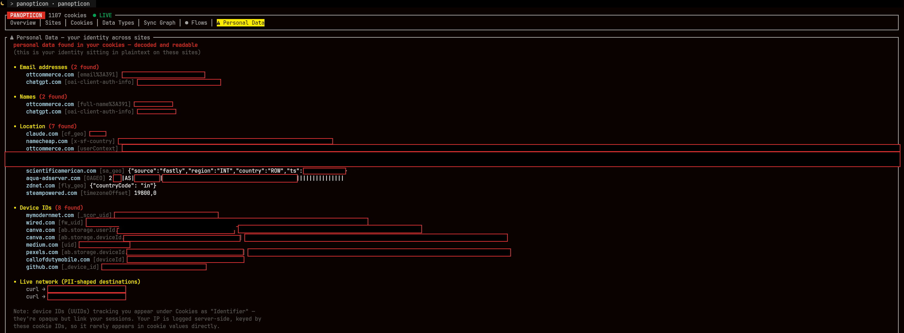
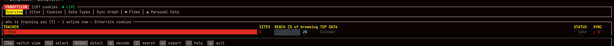
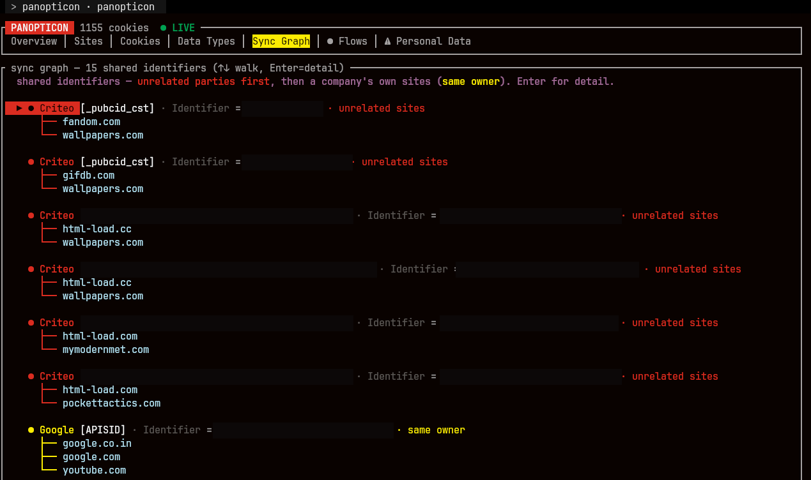

<div align="center">

```
██████╗  █████╗ ███╗   ██╗ ██████╗ ██████╗ ████████╗██╗ ██████╗ ██████╗ ███╗   ██╗
██╔══██╗██╔══██╗████╗  ██║██╔═══██╗██╔══██╗╚══██╔══╝██║██╔════╝██╔═══██╗████╗  ██║
██████╔╝███████║██╔██╗ ██║██║   ██║██████╔╝   ██║   ██║██║     ██║   ██║██╔██╗ ██║
██╔═══╝ ██╔══██║██║╚██╗██║██║   ██║██╔═══╝    ██║   ██║██║     ██║   ██║██║╚██╗██║
██║     ██║  ██║██║ ╚████║╚██████╔╝██║        ██║   ██║╚██████╗╚██████╔╝██║ ╚████║
╚═╝     ╚═╝  ╚═╝╚═╝  ╚═══╝ ╚═════╝ ╚═╝        ╚═╝   ╚═╝ ╚═════╝ ╚═════╝ ╚═╝  ╚═══╝
```

**See what trackers, cookies, and data brokers know about you — locally, in your terminal.**


</div>

**A local privacy observatory.** Panopticon shows you what the websites you
visit actually store about you, who they send your data to, and how tracking
companies link your identity across sites — all from your own machine, in a
terminal dashboard.

It reads data that is *already on your computer* (your browser's cookies, your
outbound network connections) and makes the invisible visible: which trackers
watch you, what personal data sits in plaintext in your cookies, and which
companies are quietly building a combined profile of everything you do.

> **Panopticon is a tool for auditing your _own_ privacy.** See
> [Responsible Use](#responsible-use) before running it.



*Panopticon found this personal data sitting in plaintext in browser cookies —
email, name, location, and device IDs — and exactly which sites hold it.
(Values redacted in this screenshot; on your own machine they're shown in full.)*

---

## What it shows you

Panopticon presents everything in a seven-tab terminal interface:

- **Overview** — who is tracking you, ranked by reach (what % of your browsing
  each company sees), whether they're active now, and what data they collect.

  
- **Sites** — every site setting cookies, ranked by how many trackers it hosts.
- **Cookies** — every cookie, with category, entropy (is it a tracking ID?),
  and SameSite flag (can it follow you cross-site?). Filter by category or a
  PII chip; search by name/host; decode scrambled values.
- **Data Types** — a breakdown of what kinds of data are being collected.
- **Sync Graph** — when the same hidden ID appears on multiple sites, a broker
  (Criteo, Google, …) can merge your activity. Shown as a hub-and-spoke map
  with the broker named and the linked sites listed.

  
- **Flows** — live outbound network connections, each destination's owning
  company resolved via a full ASN database (works even under encrypted DNS).
- **Personal Data** — your actual identity found in cookie values: email, name,
  location, phone, IP, device IDs — decoded and grouped by type.

Export reports (press `e`): a full audit, a cookie-detail report, or a
personal-data report — each either redacted (safe to share) or full (private).

---

## Responsible Use

**Only run Panopticon against your own machine and your own browsing.**

- It inspects *your* cookies and *your* network traffic on a computer you own.
- It is **not** a tool for surveilling other people. Using it to capture or
  analyze someone else's data without their informed consent may be illegal in
  your jurisdiction and is against the spirit of the project.
- The eBPF network-capture component sees connection metadata for the whole
  machine — run it only on a device you control.

Panopticon exists to give *you* visibility into *your own* privacy.

---

## Your data stays yours

Panopticon is a privacy tool, so it holds itself to a privacy standard. See
[SECURITY.md](SECURITY.md) for the full statement. In short:

- **Raw cookie values are never written to disk.** Values that may contain
  personal data are read live from your browser only when you view a specific
  cookie, held in memory, and never persisted.
- Only non-sensitive metadata (names, categories, entropy) is cached.
- Your browsing logs stay local and are git-ignored.
- **No telemetry. Nothing is ever sent off your machine.**
- Reads are read-only — Panopticon never modifies your browser.

---

## Install

**Requirements:** Linux, a recent Rust toolchain, Python 3 (for setup), and
**Firefox** (see Browser Support below). eBPF flow capture needs a recent kernel.

```bash
git clone https://github.com/Consigliere-X/panopticon
cd panopticon
./fetch-data.sh          # fetch reference datasets (PSL, tracker map, ASN)
cargo build --release
```

### Browser support

Panopticon currently reads **Firefox** cookies only. Chromium/Chrome support is
planned but not yet implemented: Chromium encrypts cookie values with an OS-keyring
key, so reading them requires keyring decryption that isn't in place yet. On
Chromium the value-based features (PII detection, sync, decode) wouldn't work, so
it's Firefox-only for now. Contributions toward Chromium support are welcome.

---

## Usage

Two halves: a **cookie/privacy analyzer** (no root) and a **live network
watcher** (needs privileges for eBPF).

```bash
./target/release/panopticon --app        # main dashboard, no root required
sudo systemctl enable --now panopticon   # optional live flow capture
```

Inside: `Tab` switches views, arrows move, `Enter` opens details, `/` searches,
`e` exports, and **`?` opens a plain-English legend** of every term and key.

---

## How it works

- **Cookie analysis** reads Firefox's `cookies.sqlite` read-only; tracking IDs
  are detected by fingerprint, not a blocklist, so first-party trackers show up.
- **Sync detection** hashes values to find the same ID across sites, attributing
  the broker via the DuckDuckGo Tracker Radar dataset + a local override list.
- **Flow capture** uses eBPF, resolves each IP's owner against a full ip2asn
  table, and recovers hostnames via a DNS tap and reverse-DNS.
- **Domain parsing** uses the Public Suffix List (`example.co.uk` handled right).

Reference data is fetched by `fetch-data.sh` from publicsuffix.org, DuckDuckGo
Tracker Radar, and iptoasn.com, then condensed locally.

---

## Status

A personal / research project, provided as-is under the [MIT License](LICENSE)
with no warranty. Review the source — especially the eBPF component, which runs
in kernel space — before running. Contributions and issues welcome.
