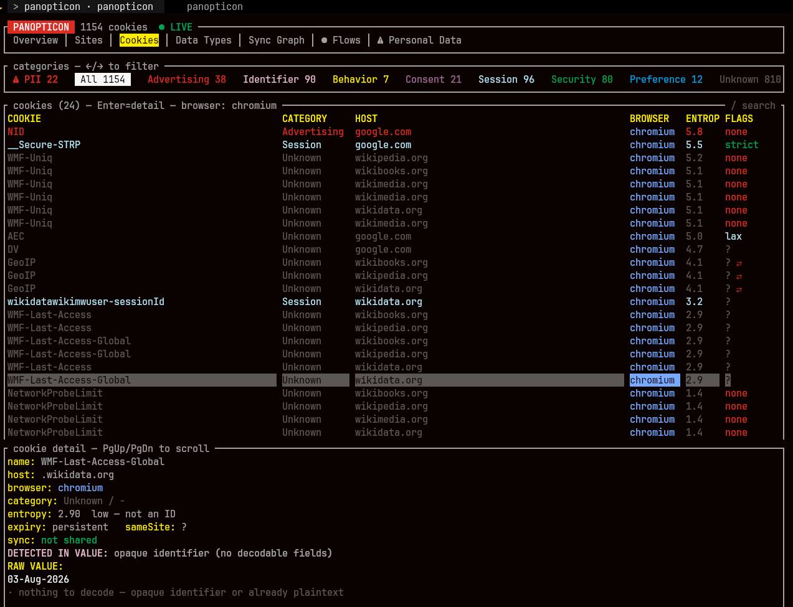
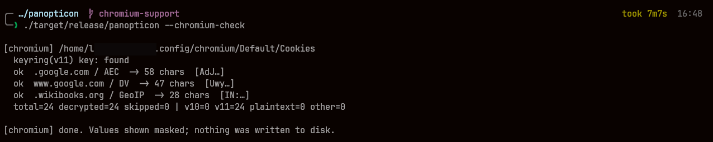

<div align="center">

```
██████╗  █████╗ ███╗   ██╗ ██████╗ ██████╗ ████████╗██╗ ██████╗ ██████╗ ███╗   ██╗
██╔══██╗██╔══██╗████╗  ██║██╔═══██╗██╔══██╗╚══██╔══╝██║██╔════╝██╔═══██╗████╗  ██║
██████╔╝███████║██╔██╗ ██║██║   ██║██████╔╝   ██║   ██║██║     ██║   ██║██╔██╗ ██║
██╔═══╝ ██╔══██║██║╚██╗██║██║   ██║██╔═══╝    ██║   ██║██║     ██║   ██║██║╚██╗██║
██║     ██║  ██║██║ ╚████║╚██████╔╝██║        ██║   ██║╚██████╗╚██████╔╝██║ ╚████║
╚═╝     ╚═╝  ╚═╝╚═╝  ╚═══╝ ╚═════╝ ╚═╝        ╚═╝   ╚═╝ ╚═════╝ ╚═════╝ ╚═╝  ╚═══╝
```

**See what trackers, cookies, and data brokers know about you — locally, in your terminal.**


</div>

**A local privacy observatory.** Panopticon shows you what the websites you
visit actually store about you, who they send your data to, and how tracking
companies link your identity across sites — all from your own machine, in a
terminal dashboard.

It reads data that is *already on your computer* (your browser's cookies, your
outbound network connections) and makes the invisible visible: which companies
have cookies in your browsers and which of them follow you across sites you
didn't visit them on, what personal data sits in plaintext in your cookies, and
where the same hidden identifier turns up on more than one site.

> **Panopticon is a tool for auditing your _own_ privacy.** See
> [Responsible Use](#responsible-use) before running it.


*Panopticon found this personal data sitting in plaintext in browser cookies —
email, name, location, and device IDs — and exactly which sites hold it.
(Values redacted in this screenshot; on your own machine they're shown in full.)*

---

## What it shows you

Panopticon presents everything in a seven-tab terminal interface:

- **Overview** — every company with cookies in your browsers, ranked by reach
  (what % of your browsing each one sees), whether they're active now, and what
  data they collect. Each is labelled **third-party** (present on sites it does
  not own — an ad or analytics company riding along) or **first-party** (a site
  you actually visited). Third parties are listed first.

  
- **Sites** — every site setting cookies, ranked by how many trackers it hosts.
- **Cookies** — every cookie, with category, entropy (is it a tracking ID?),
  and SameSite flag (can it follow you cross-site?). Filter by category or a
  PII chip; search by name/host; decode scrambled values.

  
- **Data Types** — a breakdown of what kinds of data are being collected.
- **Sync Graph** — when the same hidden ID appears on several sites, whoever set
  it can tell those visits are one person. Shown as a hub-and-spoke map with the
  linked sites listed. Panopticon separates two cases: an ID shared across sites
  owned by *different* parties (flagged, the ad-broker case) from one shared
  across a single company's own properties (`SAME-OWNER` — worth knowing, but not
  evidence of a deal between companies).

  
- **Flows** — live outbound network connections, each destination's owning
  company resolved via a full ASN database (works even under encrypted DNS).
- **Personal Data** — your actual identity found in cookie values: email, name,
  location, phone, IP, device IDs — decoded and grouped by type.

Export reports (press `e`): a full audit, a cookie-detail report, or a
personal-data report — each either redacted (safe to share) or full (private).

---

## Responsible Use

**Only run Panopticon against your own machine and your own browsing.**

- It inspects *your* cookies and *your* network traffic on a computer you own.
- It is **not** a tool for surveilling other people. Using it to capture or
  analyze someone else's data without their informed consent may be illegal in
  your jurisdiction and is against the spirit of the project.
- The eBPF network-capture component sees connection metadata for the whole
  machine — run it only on a device you control.

Panopticon exists to give *you* visibility into *your own* privacy.

---

## Your data stays yours

Panopticon is a privacy tool, so it holds itself to a privacy standard. See
[SECURITY.md](SECURITY.md) for the full statement. In short:

- **The cookie metadata cache holds no raw values** — only names, hosts,
  categories, entropy and a truncated hash. Values are decrypted and analysed
  in memory, then discarded.
- Two exceptions, both deliberate: values shared across sites are recorded in
  `data/sync_clusters.tsv` (that shared ID *is* the tracking evidence), and a
  full PII report contains decoded personal data if you explicitly export one.
- Your browsing logs stay local and are git-ignored.
- **No telemetry.** Your cookies, browsing history and personal data never
  leave your machine. The `--watch` daemon does send reverse-DNS lookups to your
  system resolver to name the IPs it sees — see [SECURITY.md](SECURITY.md).
- Reads are read-only — Panopticon never modifies your browser.

---

## Install

**Requirements:** Linux (any distribution), Rust 1.85+ (the crate uses edition
2024), Python 3 (for setup), and a supported browser — **Firefox** or a
**Chromium-family** browser (see Browser Support below).

Live flow capture additionally needs a recent kernel and an eBPF toolchain —
nightly Rust with `rust-src`, plus `bpf-linker`. `build.sh` checks for these and
tells you exactly what to install. If you don't want live capture, run
`./build.sh --no-bpf`; everything else (cookies, PII, sync, reports) works
without it.

Cookie, PII and sync analysis is distribution-agnostic. Two things are
best-effort outside Arch: naming the package behind a network flow (Panopticon
queries `pacman`, `dpkg`, `rpm`, `apk` or `xbps-query`, and shows `unpackaged` if
none of them answer), and the systemd unit, which assumes systemd. Only the
`pacman` path has been tested on real hardware — reports from other
distributions are welcome.

```bash
git clone https://github.com/Consigliere-X/panopticon
cd panopticon
./fetch-data.sh          # fetch reference datasets (PSL, tracker map, ASN)
./build.sh
```

### Browser support

Panopticon reads both **Firefox** and **Chromium-family** browsers — Chrome,
Chromium, Brave, Edge, Vivaldi, and Opera — whether installed natively, via
**Flatpak** (`~/.var/app`), or via **Snap** (`~/snap`). All value-based features
(PII detection, cross-site sync, live decode) work on both.

Firefox stores cookie values in plaintext. Chromium encrypts them (AES-128-CBC,
key via PBKDF2). Panopticon handles both Chromium variants:

- **`v10`** — encrypted with a fixed key (no keyring). Works out of the box.
- **`v11`** — encrypted with a per-browser key stored in your desktop keyring
  (GNOME Keyring / KWallet via the Secret Service). Decrypted automatically when
  the keyring is unlocked and reachable. If there's no session keyring (e.g. a
  headless box), `v11` cookies are skipped rather than mis-read — never decoded
  into garbage.

Chrome M124+ additionally binds each value to its domain (a SHA-256 prefix);
Panopticon detects and strips this, so old and new cookies in the same profile
both decode correctly.

Verify decryption against your own cookies without writing any value to disk:

```bash
./target/release/panopticon --chromium-check
```

It prints, per profile, how many cookies decrypted and a `v10`/`v11` breakdown,
with values shown masked. If a browser is running and holds a lock, close it and
retry (Panopticon opens the DB read-only/immutable, so this is rarely needed).



As with Firefox, **decrypted values are not written to the metadata cache** —
they're held in memory for the analysis pass and fetched live in the TUI on
demand. See [SECURITY.md](SECURITY.md) for the two cases where a value does
reach disk.

---

## Usage

Two halves: a **cookie/privacy analyzer** (no root) and a **live network
watcher** (needs privileges for eBPF).

```bash
./target/release/panopticon --app        # main dashboard, no root required
./install-service.sh                     # optional live flow capture
sudo systemctl enable --now panopticon
```

Inside: `Tab` switches views, arrows move, `Enter` opens details, `/` searches,
`b` filters by browser, `r` re-reads your cookies now,
`e` exports, and **`?` opens a plain-English legend** of every term and key.

---

## How it works

- **Cookie analysis** reads Firefox's `cookies.sqlite` and Chromium's `Cookies`
  DB read-only (decrypting Chromium values in memory); tracking IDs are detected
  by fingerprint, not a blocklist, so first-party trackers show up.
- **Sync detection** hashes values to find the same ID across sites, attributing
  the broker via the DuckDuckGo Tracker Radar dataset + a local override list.
- **Flow capture** uses eBPF, resolves each IP's owner against a full ip2asn
  table, and recovers hostnames via a DNS tap and reverse-DNS.
- **Domain parsing** uses the Public Suffix List (`example.co.uk` handled right).

Reference data is fetched by `fetch-data.sh` from publicsuffix.org, DuckDuckGo
Tracker Radar, and iptoasn.com, then condensed locally.

---

## Status

A personal / research project, provided as-is under the [MIT License](LICENSE)
with no warranty. Review the source — especially the eBPF component, which runs
in kernel space — before running. Contributions and issues welcome.
